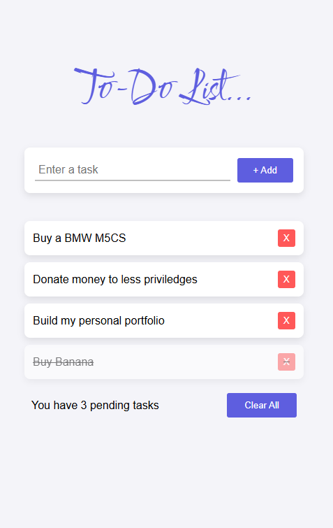

### To-Do List App

A simple and interactive to-do list app built using HTML, CSS, and JavaScript. This app allows users to add, edit, mark tasks as completed, and delete tasks from their to-do list. It also utilizes localStorage to save tasks between page refreshes.

### Live Preview

[Live Preview Link](https://todo-list-app-drab-tau.vercel.app/)

### Screenshot

